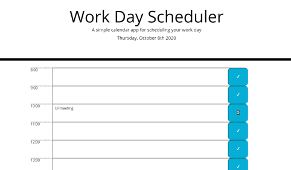

# Work Day Scheduler

## User Story

AS AN employee with a busy schedule
I WANT to add important events to a daily planner
SO THAT I can manage my time effectively

## Description

This application allows hour-wise work day schedules to be displayed on an easy-to-access, intuitive, user-friendly interface.

1 "time-block" = 1 hour

- Time-blocks in the past are coloured gray. Present hour time block is coloured green.
- 'Status' of time-block changes to an hourglass if a task is added to it.
- If a task is deleted from time-block (assuming this means it is completed), status is changed back from an hourglass to a tick-mark.
- Tasks are saved locally.
- Mobile-responsive.

## Tools and Technologies

- jQuery
- JavaScript
- HTML/CSS
- Bootstrap

## Visuals

## Project Status

Ongoing. Multiple feature additions can be done.

## <a href="https://prabhm512.github.io/work-day-scheduler/">Deployed Project (click to view)</a>
